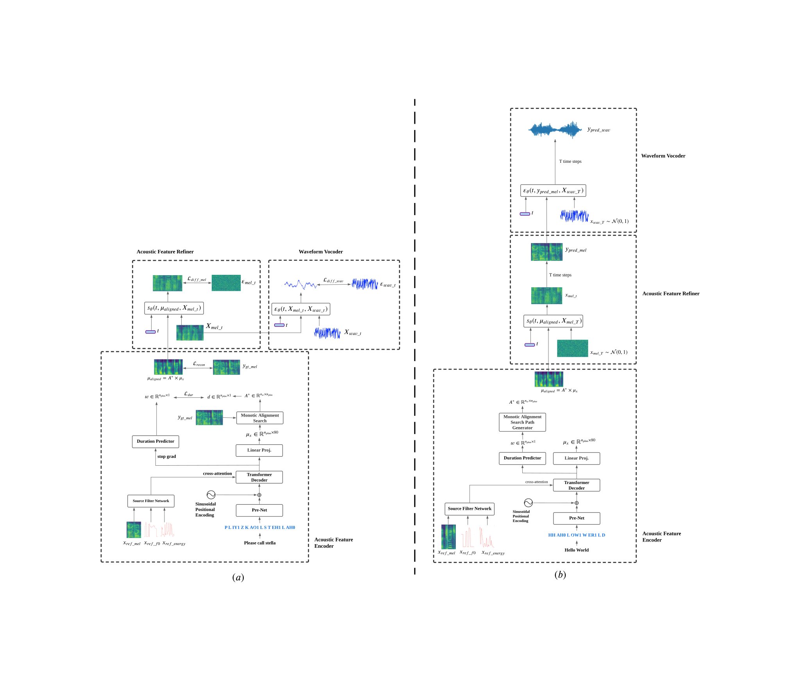
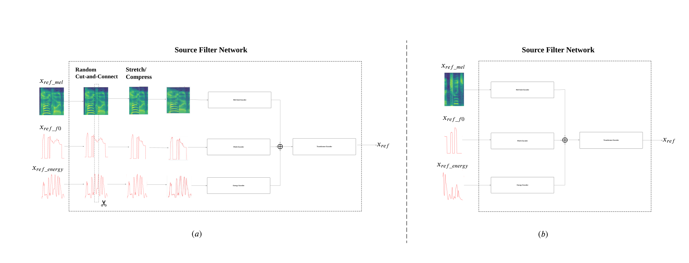

# Zero-Voice: A Low-Resource Approach For Zero-shot Text-to-Speech

This repo holds the codes of paper: "Zero-Voice: A Low-Resource Approach For Zero-shot Text-to-Speech".

## News

**[Aug. 29, 2024]** We release the Demos for Zero-Voice on LibriTTS (train-clean-100) and Te Reo Maori;  ASR on Te Reo Maori.

## Overview

In this paper, we propose  Zero-Voice, a novel zero-shot text-to-speech (TTS) method, which  consists of an Acoustic Feature Encoder, an Acoustic Feature Refiner, and a Waveform Vocoder, specifically optimized for low-resource scenarios with innovations in two key aspects: 
(i) To enhance Zero-Voice's zero-shot capability, we propose a novel Source Filter Network for unsupervised decoupling of the prosodic components of a reference speaker's voice; 
(ii) To enhance the quality of synthesized audio, we train the Acoustic Feature Refiner and the Waveform Vocoder concurrently using two diffusion models respectively. This method enables the Acoustic Feature Refiner to generate mel-spectrograms and the Waveform Vocoder to simultaneously produce high-fidelity audios conditioned on these mel-spectrograms. 
We conduct objective experiments under low-resource settings to compare our model with recent strong zero-shot TTS baseline methods under high-resource settings (e.g., StyleTTS 2 and HierSpeech++). Experimental results demonstrate that Zero-Voice achieves comparable performance to these high-resource methods. 
Notably, Zero-Voice demonstrates strong generalization and robustness even when trained on a very small number of speakers and small datasets (e.g., 5-8 hours of transcribed data). Moreover, we collect and label 27 hours Te Reo Māori speech data (i.e., an official and endangered language of New Zealand). We train the Zero-Voice model on this dataset, and use it to synthesize Te Reo Māori speech data to enhance speech recognition models for the language. This approach yields state-of-the-art results for the Māori (language code: nz\_mi) test set of Google Fleurs dataset.
Project demo page is at https://github.com/zwan074/zero-voice/.

<figure>

<figcaption>Zero-Voice Train (left) and Inference (Right) </figcaption>
</figure>

<figure>

<figcaption>Zero-Voice Source Filter Network </figcaption>
</figure>

## Hugging Face Space Demo

- Zero-Voice (Trained on LibriTTS (train-clean-100) subset) [[zero-voice](https://huggingface.co/spaces/zwan074/zero-voice)] 
- Zero-Voice Low-Resource (Trained on 1/8 size of LibriTTS (train-clean-100) subset)  [[zero-voice-lr](https://huggingface.co/spaces/zwan074/zero-voice-lr)] 
- Zero-Voice Te Reo Māori (Trained on 27 hours Te Reo Māori data)  [[zero-voice-te-reo](https://huggingface.co/spaces/zwan074/zero-voice-te-reo)] 
- Te Reo Māori ASR ( Fine-tuning OpenAI Whisper Large-v3 model with 27 hours Te Reo Māori data and 360 hours synthesised data from Zero-Voice Te Reo Māori model)  [[whisper-te-reo](https://huggingface.co/spaces/zwan074/whisper-te-reo)] 
