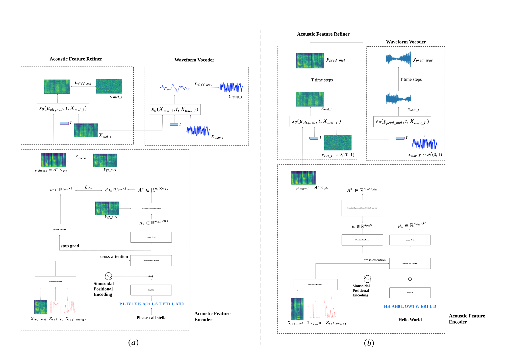

# Zero-Voice: A Low-Resource Approach For Zero-shot Text-to-Speech

This repo holds the codes of paper: "Zero-Voice: A Low-Resource Approach For Zero-shot Text-to-Speech".

## News

**[Aug. 29, 2024]** We release the Demos for Zero-Voice on LibriTTS (train-clean-100) and Te Reo Maori;  ASR on Te Reo Maori.

## Overview

In this paper, we propose  Zero-Voice, a novel zero-shot text-to-speech (TTS) method, which  consists of an Acoustic Feature Encoder, an Acoustic Feature Refiner, and a Waveform Vocoder, specifically optimized for low-resource scenarios with innovations in two key aspects: 
(i) To enhance Zero-Voice's zero-shot capability, we propose a novel Source Filter Network for unsupervised decoupling of the prosodic components of a reference speaker's voice; 
(ii) To enhance the quality of synthesized audio, we train the Acoustic Feature Refiner and the Waveform Vocoder concurrently using two diffusion models respectively. This method enables the Acoustic Feature Refiner to generate mel-spectrograms and the Waveform Vocoder to simultaneously produce high-fidelity audios conditioned on these mel-spectrograms. 
We conduct objective experiments under low-resource settings to compare our model with recent strong zero-shot TTS baseline methods under high-resource settings (e.g., StyleTTS 2 and HierSpeech++). Experimental results demonstrate that Zero-Voice achieves comparable performance to these high-resource methods. 
Notably, Zero-Voice demonstrates strong generalization and robustness even when trained on a very small number of speakers and small datasets (e.g., 5-8 hours of transcribed data). Moreover, we collect and label 27 hours Te Reo Māori speech data (i.e., an official and endangered language of New Zealand). We train the Zero-Voice model on this dataset, and use it to synthesize Te Reo Māori speech data to enhance speech recognition models for the language. This approach yields state-of-the-art results for the Māori (language code: nz\_mi) test set of Google Fleurs dataset.
Project demo page is at https://github.com/zwan074/zero-voice/.

<figure>

<figcaption>In the Training Procedure (a), we jointly train three components: the Acoustic Feature Encoder, the Acoustic Feature Refiner, and the Waveform Vocoder. During the Inference Procedure (b), the Acoustic Feature Encoder processes speech prompts and phonemes to generate the aligned acoustic features, denoted as $\mu_{aligned}$. The Acoustic Feature Refiner then refines these features, reducing noise to produce the predicted mel-spectrogram output, $y_{pred\_mel}$. Finally, the Waveform Vocoder converts $y_{pred\_mel}$ into the final waveform output, $y_{pred\_wave}$. Additionally, Fig. \ref{data_preprocessing} provides detailed information on pipeline of the speech prompts processed by the Source Filter Network within the Acoustic Feature Encoder.</figcaption>
</figure>

<figure>

<figcaption>\textbf{ Pipeline of Source Filter Network:} (a) 
During training, the speech prompts $x_{ref\_mel}$, $x_{ref\_pitch}$, and $x_{ref\_energy}$, which represent the mel-spectrograms, pitch, and energy derived from the waveform, undergo a random cut-and-connect process that truncates their time-domain features. These truncated features are stretched or compressed to distort their rhythm, and are then aligned by three encoders: the Mel-Style Encoder, Pitch Encoder and Energy Encoder. Subsequently, elementwise-summation of the outpts from the three encoders, and the Transformer Encoder modules produce $x_{ref}$;
(b) During inference, the speech prompts $x_{ref\_mel}$, $x_{ref\_pitch}$, and $x_{ref\_energy}$ are directly used as input for the three encoders and the Transformer Encoder to produce $x_{ref}$. </figcaption>
</figure>

## Hugging Face Space Demo

- Zero-Voice (Trained on LibriTTS (train-clean-100) subset) [[zero-voice](https://huggingface.co/spaces/zwan074/zero-voice)] 
- Zero-Voice Low-Resource (Trained on 1/8 size of LibriTTS (train-clean-100) subset)  [[zero-voice-lr](https://huggingface.co/spaces/zwan074/zero-voice-lr)] 
- Zero-Voice Te Reo Māori (Trained on 27 hours Te Reo Māori data)  [[zero-voice-te-reo](https://huggingface.co/spaces/zwan074/zero-voice-te-reo)] 
- Te Reo Māori ASR ( Fine-tuning OpenAI Whisper Large-v3 model with 27 hours Te Reo Māori data and 360 hours synthesised data from Zero-Voice Te Reo Māori model)  [[whisper-te-reo](https://huggingface.co/spaces/zwan074/whisper-te-reo)]

## Installation

Firstly, install all Python package requirements:

```bash
pip install -r requirements.txt
```

Secondly, build `monotonic_align` code (Cython):

```bash
cd model/monotonic_align; python setup.py build_ext --inplace; cd ../..
```

## Training

1. Make filelists of your audio data like ones included into `resources/filelists` folder.  
2. Set experiment configuration in `params.py` file.
3. Specify your GPU device and run training script:
    ```bash
    export CUDA_VISIBLE_DEVICES=YOUR_GPU_ID
    python train.py 
    ```
4.  You can download Grad-TTS and HiFi-GAN checkpoints trained on LJSpeech* and Libri-TTS datasets (22kHz) from [here](https://drive.google.com/drive/folders/1grsfccJbmEuSBGQExQKr3cVxNV0xEOZ7?usp=sharing).
5.  During training all logging information and checkpoints are stored in `log_dir`, which you can specify in `params.py` before training.

## Inference

1. Set up `model_ckpt_path`, `ref_speech_path`, and `text` in `inference.py` file.
4. inference:
    ```bash
    model_ckpt_path = 'logs/zero_voice/grad_16.pt'
    ref_speech_path = '/workspace/dm_datasets/LibriTTS/train-clean-100/7190/90543/7190_90543_000005_000001.wav'
    text = 'What sort of evidence is there?'
    ```
5. Check out folder called `out.wav` for generated audios.

   
## Reference

Some code snipet are from :

Grad-TTS [[Grad-TTS](https://github.com/huawei-noah/Speech-Backbones/tree/main/Grad-TTS)] 
DiffWave [[Grad-TTS](https://github.com/lmnt-com/diffwave)] 
